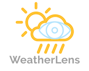
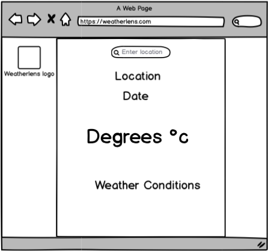
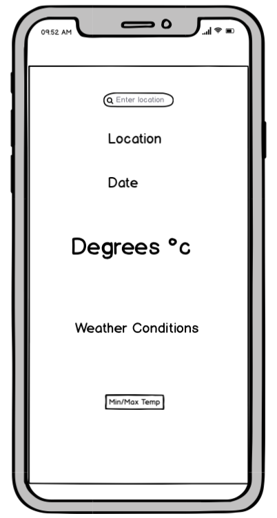
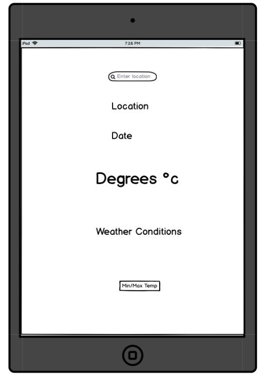

# WeatherLens 
---

## Introduction

A weather app designed to bring the up to date **weather** to the user. The user can search the location they want and recieved the current **weather** conditions for that location instantly. **WeatherLens** is designed to respond to the users inputs and display the **weather** information they are seeking. 

## UX
---

### User Stories

*Generic User*

* As a user, I want to be able to **search** for a location.

* As a user, I want to be able to **identify** the weather in my chosen location.

*  As a user, I want to be able to **access numerous locations** on my visit to WeatherLens.

* As a user, I want to be able to see the **temperature** in my chosen location.

### Design 
1. **Logo**
The logo was created using [Free Logo Maker](https://logomakr.com) and was designed to incorporate the **weather** and the **lens** that allows you to view the weather in a chosen location.

2. **Colour Scheme**

The colours for the website were chosen using [Coolor](https://coolors.co/3c1642-086375-1dd3b0-fffdfd-ffffff) and aim to represent the different weathers. The chosen colours are:

*  `#656565` - Dim Grey
*  `#89BBFE` - French Sky Blue 
*  `#FFC857` - Maximum Yellow Red

3. **Fonts**

The website has the main font of Arvo, which was chosen due to it **readability for all users**. It was chosen using [Google Fonts](https://fonts.googleapis.com/css2?family=Arvo&display=swap) and has a default of Sans Serif.

4. **Wireframes**

The following wireframes were created using [Balsamiq](https://balsamiq.com/wireframes/?gclid=CjwKCAjwltH3BRB6EiwAhj0IUBrAHe-2BiRjQmQGSO-FZIjoEjkckL_kVyJXd5ShGVwKqDaDMqKjvBoCQksQAvD_BwE)

## Features
---

### Existing Features

* A **search bar** at the top of the page that will allow the user to search for any location in the world. 

* The **location** written below the search bar based in the users input. 

* The **date** of the current search

* The **temperature** in the location that the user has search for.

* The **weather conditions** of the location that the user has chosen to search.

### Features Left to Implement

* A **five day forecast** that will allow users to not only see the current weather but also the weather predicted for the next ffive days.

* **Animated weather icons** that automatically change according to the weather in the users searched location. 

* Load the **Users location** when the app loads so it automatically gives them the weather where they are rather than having to search for it.

## Technologies Used
---
### **Languages**

* HTML

* CSS

* JavaScipt

### **Frameworks and Libraries**

* [Google Fonts](https://fonts.google.com/specimen/Lato?sidebar.open&selection.family=Lato)
* [JSON](https://www.json.org/json-en.html)
* [Font Awesome](https://fontawesome.com/)

### **Tools Used**

* [Coolors](https://coolors.co/3c1642-086375-1dd3b0-fffdfd-ffffff) 
* [Balsamiq](https://balsamiq.com/wireframes/?gclid=CjwKCAjwltH3BRB6EiwAhj0IUBrAHe-2BiRjQmQGSO-FZIjoEjkckL_kVyJXd5ShGVwKqDaDMqKjvBoCQksQAvD_BwE)
* [Free Logo Maker](https://logomakr.com)
* [Gitpod Online IDE](https://www.gitpod.io/)
* [Github](https://github.com/)
* [Favicon Creator](https://www.favicon.cc/?action=import_request)

## Testing 
---

### All Sections

### Accessibility

**Aria labels** have been added to all inputs to ensure that there is accessibility for all users. 

### Validation

All code was **validated** using [W3C’s Code Validator]( https://jigsaw.w3.org/css-validator/validator) and no errors or warnings were shown. 

## Deployment
---

The webpage was developed using Gitpod IDE and was commited and pushed to a Github repository. The steps below were used to deploy my webpage.

1. Go to [Github](https://github.com/) 
2. Search for [Ted-Williams/weatherlens](https://github.com/Ted-Williams/weatherLens)
3. Select **settings** from the menu at the top of the page.
4. Scroll down to **GitHub Pages section**.
5. Click on the **dropdown menu** with in the source section and **select master branch**.
6. Click **save**.

The webpage can be found here: [weatherLens](https://ted-williams.github.io/weatherLens/.)

To create a local respository, follow the steps below:

1. Navigate to [Ted-Williams/weaherlens](https://github.com/Ted-Williams/weatherLens)
2. Below the menu **click Clone**.
3. Copy the URl using the **clipboard** to the righthand side.
4. Open you preferred IDE for example Gitpod.
5. Type **git clone** into the terminal and paste the respository URl.
6. **Click enter** and the clone will be created. 

##  Credits
---

### Content

### Media

* All images used were taken from [Google](www.google.com)

### Acknoweledgements

* I would like to thank [Simen Dehlin](https://github.com/Eventyret) for his continued support, help and words of encouragement throughout this project. 
* I would also like to thank the **slack community** at the Code Institute for the help with peer review when needed. 

 ***This project is fictitous and was created for educational purposes as part of the Code Institute Milestone Project 2***