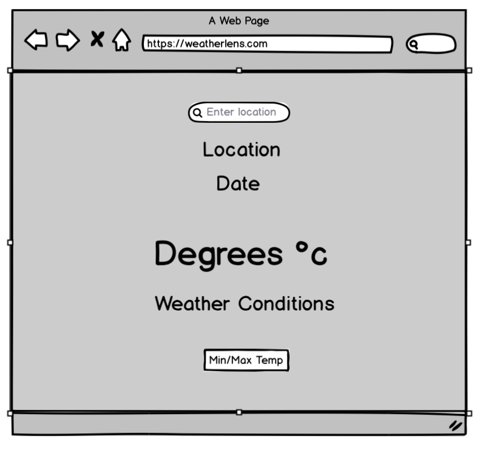

# WeatherLens 
---

## Introduction

A weather app designed to bring the up to date **weather** to the user. The user can search the location they want and recieved the current **weather** conditions for that location instantly. **WeatherLens** is designed to respond to the users inputs and display the **weather** information they are seeking. 

## UX
---

### User Stories

*Generic User*

* As a user, I want to be able to **search** for a location.

* As a user, I want to be able to **identify** the weather in my chosen location.

*  As a user, I want to be able to **access numerous locations** on my visit to WeatherLens.

* As a user, I want to be able to see the **temperature** in my chosen location.

### Design 

1. **Logo**
The logo was created using [Free Logo Maker](https://logomakr.com) and was designed to incorporate the **weather** and the **lens** that allows you to view the weather in a chosen location.

2. **Colour Scheme**

The colours for the website were chosen using [Coolor](https://coolors.co/3c1642-086375-1dd3b0-fffdfd-ffffff) and aim to represent the different weathers. The chosen colours are:

*  `#656565` - Dim Grey
*  `#89BBFE` - French Sky Blue 
*  `#FFC857` - Maximum Yellow Red

3. **Fonts**

The website has the main font of Arvo, which was chosen due to it **readability for all users**. It was chosen using [Google Fonts](https://fonts.googleapis.com/css2?family=Arvo&display=swap) and has a default of Sans Serif.

4. **Wireframes**

The following wireframes were created using [Balsamiq](https://balsamiq.com/wireframes/?gclid=CjwKCAjwltH3BRB6EiwAhj0IUBrAHe-2BiRjQmQGSO-FZIjoEjkckL_kVyJXd5ShGVwKqDaDMqKjvBoCQksQAvD_BwE)

## Features
---

### Existing Features

* A **search bar** at the top of the page that will allow the user to search for any location in the world. 

* The **location** written below the search bar based in the users input. 

* The **date** of the current search

* The **temperature** in the location that the user has search for.

* The **weather conditions** of the location that the user has chosen to search.

### Features Left to Implement

* A **five day forecast** that will allow users to not only see the current weather but also the weather predicted for the next ffive days.

* **Animated weather icons** that automatically change according to the weather in the users searched location. 

* Load the **Users location** when the app loads so it automatically gives them the weather where they are rather than having to search for it.

## Technologies Used
---
### **Languages**

* HTML

* CSS

* JavaScipt

* JSON

### **Frameworks and Libraries**

* [Google Fonts](https://fonts.google.com/specimen/Lato?sidebar.open&selection.family=Lato)
* [Font Awesome](https://fontawesome.com/)

### **Tools Used**

* [Coolors](https://coolors.co/3c1642-086375-1dd3b0-fffdfd-ffffff) 
* [Balsamiq](https://balsamiq.com/wireframes/?gclid=CjwKCAjwltH3BRB6EiwAhj0IUBrAHe-2BiRjQmQGSO-FZIjoEjkckL_kVyJXd5ShGVwKqDaDMqKjvBoCQksQAvD_BwE)
* [Free Logo Maker](https://logomakr.com)
* [Gitpod Online IDE](https://www.gitpod.io/)
* [Github](https://github.com/)
* [Favicon Creator](https://www.favicon.cc/?action=import_request)

## Testing 
---

### All Sections

**Plan** – I want the app to allow the users to search for a location and find out all the **current** weather conditions. This included showing the user the location they searched for including the country, the current date of their search, the current temperature, the conditions and the minimum and maximum temperature.

**Implementation** – Ensuring that users were able to access the information for the relevant location based on their search. The information is clear and concise as not to confuse the user.

**Test** –  This was tested by asking friends and family to use the app and to see if they could search any location. 

**Result** – The weather information was presented to the user from the location that they searched. 

**Verdict** – This test passed based on the notes in the criteria above. 

### Search Box

#### User Story - To be able to search for a chosen location.

**Plan** – For the users to be able to type in the location that they wanted to search. 

**Implementation** – Placeholder text was added to the input to ensure that user knew what the search box was for. 

**Test** –  This was tested by asking friends and family to use the app and to see if they could search any location. 

**Result** – All users were able to use the search box as intented to get the current weather conditions for their searched location. 

**Verdict** – This test passed based on the notes in the criteria above. 

### Search Button and Enter Button to Conduct Search

**Plan** – The button was added to allow users to search for a location if they were not able to press the enter key. 

**Implementation** – The search button was added to the same function as the enter key in the JavaScipt file. This gave the users a choice but also if a user was using their phone with no enter button, they would still be able to search by pressing the button. 

**Test** –  This was tested by entering a lot of different locations into the search box and using a combination of the enter key and the search button to get the results.

**Result** – Both methods were success in allowing the user to search for their desired location.

**Verdict** – This test passed based on the notes in the criteria above. 

### Information Displayed

**Plan** – For the weather information to be displayed to the user in a clear manner so that they could quickly understand the weather conditions in their chosen location.

**Implementation** – The styling for the weather information is done in a way that is clear and shows the user the information in an understandable way. The most important information such as the temperature and the current weather conditions are presented in the largest text to ensure this. 

**Test** –  This was tested by friends and family to ensure they are able to understand the weather information they are being shown as quickly as possible. 

**Result** – The users were able to understand the weather information for the chosen locations without any questions. 

**Verdict** – This test passed based on the notes in the criteria above. 

### Fetch from Open weather API

**Plan** – For the weather data to be fetched for each location that the user searched for. 

**Implementation** – By using an API key and URL alongside the relevant functions that allow the user to search for any valid locations. 

**Test** –  This was tested by myself to ensure the information was being fetched properly. I attempted various different locations over a couple of days to ensure the data was still being returned. I also used chrome developer tools to look at the console and check there were no errors being presented.

**Result** – The fetch funtion is able to return the correct weather information from the API and display it correctly. 

**Verdict** – This test passed based on the notes in the criteria above. 

### Error Message 

**Plan** – For an error message to appear when the user tries to search for an invalid location.

**Implementation** – By adding an throw catch methods to detect and deal with any errors that might appear in the console in chrome developer tools. If an error occurs then an alert will pop up and tell the user that they have search for an invalid location and to try again. 

**Test** –  By entering random letters into the search box and trying to search. 

**Result** – An alert box appears when the search is invalid instructing the user to try again.

**Verdict** – This test passed based on the notes in the criteria above. 

### Responsiveness 

**Plan** – For the app to work across all devices and screen dimensions. 

**Implementation** – To insert media queries to enure the information still displays correctly. 

**Test** –  Using chrome developer tools to look at the app across different devices and screen dimensions.

**Result** – The app is responsive across all devices and screen dimensions above 260px.

**Verdict** – This test passed based on the notes in the criteria above. 

### Accessibility

**Aria labels** have been added to all inputs to ensure that there is accessibility for all users. 

### Validation

All code was **validated** using [W3C’s Code Validator]( https://jigsaw.w3.org/css-validator/validator) and no errors or warnings were shown. 

### Lighthouse Testing in Chrome Developer Tools

**A Lighthouse audit** was run in Chrome Developer tools and found that the performance, accessibility, best practices and SEO came back as green with scores between 90 and 100. 

## Deployment
---

The webpage was developed using Gitpod IDE and was commited and pushed to a Github repository. The steps below were used to deploy my webpage.

1. Go to [Github](https://github.com/) 
2. Search for [Ted-Williams/weatherlens](https://github.com/Ted-Williams/weatherLens)
3. Select **settings** from the menu at the top of the page.
4. Scroll down to **GitHub Pages section**.
5. Click on the **dropdown menu** with in the source section and **select master branch**.
6. Click **save**.

The webpage can be found here: [weatherLens](https://ted-williams.github.io/weatherLens/.)

To create a local respository, follow the steps below:

1. Navigate to [Ted-Williams/weaherlens](https://github.com/Ted-Williams/weatherLens)
2. Below the menu **click Clone**.
3. Copy the URl using the **clipboard** to the righthand side.
4. Open you preferred IDE for example Gitpod.
5. Type **git clone** into the terminal and paste the respository URl.
6. **Click enter** and the clone will be created. 

##  Credits
---

### Content

### Media

* All images used were taken from [Google](www.google.com)

### Acknoweledgements

* The basic elements of the weather application were helped by using the following tutorial [Weather App Tutorial](https://www.youtube.com/watch?v=n4dtwWgRueI&t=1215s)

* I would like to thank [Simen Dehlin](https://github.com/Eventyret) for his continued support, help and words of encouragement throughout this project. 
* I would like to thank the **Tutor support** at the Code Institute for their help. 
* I would also like to thank the **slack community** at the Code Institute for the help with peer review when needed. 

 ***This project is fictitous and was created for educational purposes as part of the Code Institute Milestone Project 2***